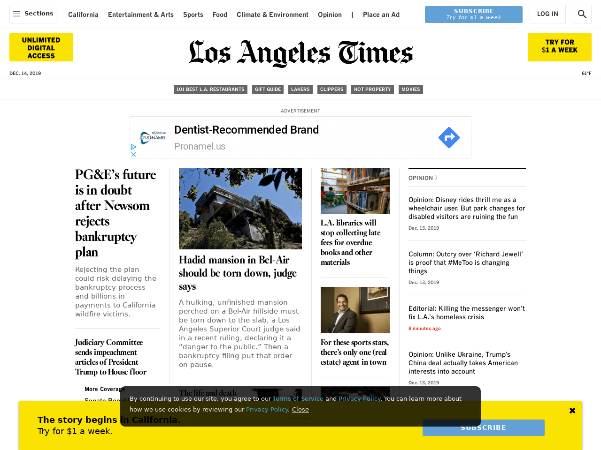

[](https://www.repostatus.org/#active)
[](https://keybase.io/hrbrmstr)

[](https://travis-ci.org/hrbrmstr/statically)  


# statically

Generate Webpage Screenshots Using the Statically API

## Description

Statically (<https://statically.io/screenshot/>) maintains a free API to
generate screenshots of webpages. Tools are provided to capture website
screenshots using this API.

## What’s Inside The Tin

The following functions are implemented:

  - `generate_screenshot`: Generate a webpage screenshot

## Installation

``` r
remotes::install_git("https://git.rud.is/hrbrmstr/statically.git")
# or
remotes::install_git("https://git.sr.ht/~hrbrmstr/statically")
# or
remotes::install_gitlab("hrbrmstr/statically")
# or
remotes::install_bitbucket("hrbrmstr/statically")
```

NOTE: To use the ‘remotes’ install options you will need to have the
[{remotes} package](https://github.com/r-lib/remotes) installed.

## Usage

``` r
library(statically)

# current version
packageVersion("statically")
## [1] '0.1.0'
```

Default:

``` r
generate_screenshot("https://www.latimes.com/")
```

<!-- -->

Mobile:

``` r
generate_screenshot("https://www.latimes.com/", mobile = TRUE)
```

<!-- -->

Full page (not shown b/c it’s super duper long):

``` r
generate_screenshot("https://rud.is/b", full_page = TRUE)
```

## statically Metrics

| Lang | \# Files | (%) | LoC |  (%) | Blank lines |  (%) | \# Lines |  (%) |
| :--- | -------: | --: | --: | ---: | ----------: | ---: | -------: | ---: |
| R    |        4 | 0.8 |  38 | 0.78 |          11 | 0.34 |       29 | 0.44 |
| Rmd  |        1 | 0.2 |  11 | 0.22 |          21 | 0.66 |       37 | 0.56 |

## Code of Conduct

Please note that this project is released with a Contributor Code of
Conduct. By participating in this project you agree to abide by its
terms.
